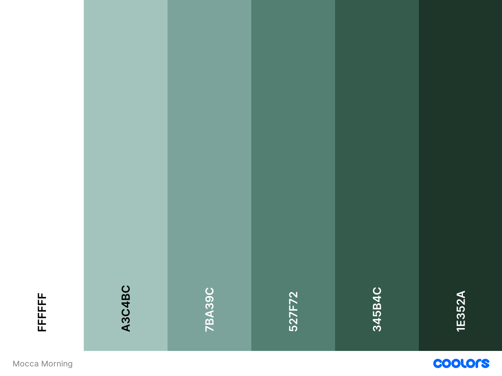
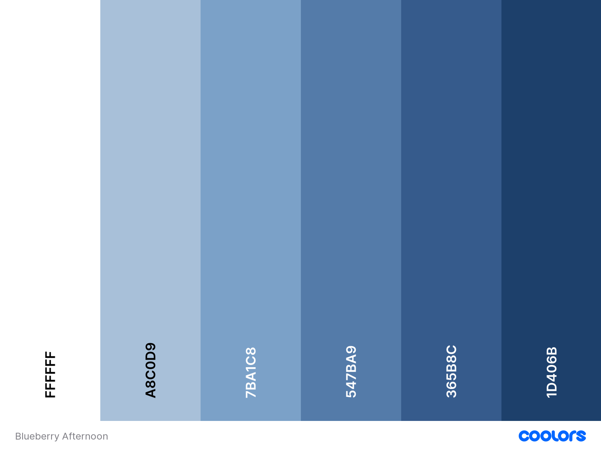
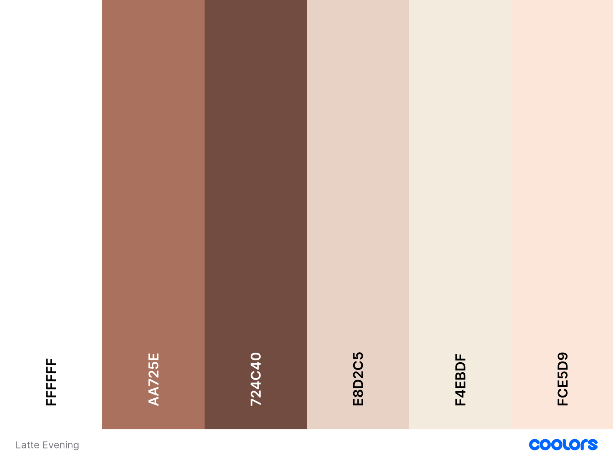
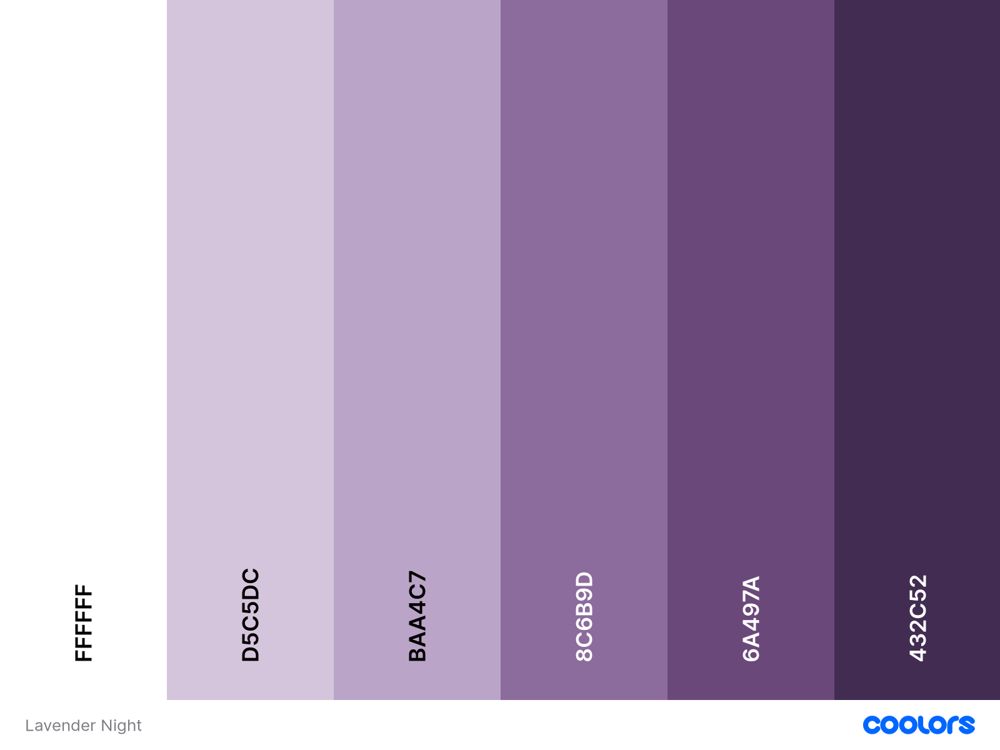

# Paper Wonderland theme/color guide
Down below you can find the different colors used in each of the themes available in the game

# Mocca Morning
- (Hex):#FFFFFF 
- (Hex):#A3C4BC 
- (Hex):#7BA39C 
- (Hex):#527F72 
- (Hex):#345B4C 
- (Hex):#1E352A 

# Blueberry Afternoon
- (Hex):#FFFFFF 
- (Hex):#A8C0D9
- (Hex):#7BA1C8 
- (Hex):#547BA9 
- (Hex):#365B8C
- (Hex):#1D406B 

# Latte Evening
- (Hex):#FFFFFF 
- (Hex):#AA725E 
- (Hex):#724C40 
- (Hex):#E8D2C5 
- (Hex):#F4EBDF
- (Hex):#FCE5D9 

# Lavender Night
- (Hex):#FFFFFF 
- (Hex):#D5C5DC 
- (Hex):#BAA4C7 
- (Hex):#8C6B9D
- (Hex):#6A497A
- (Hex):#432C52 

